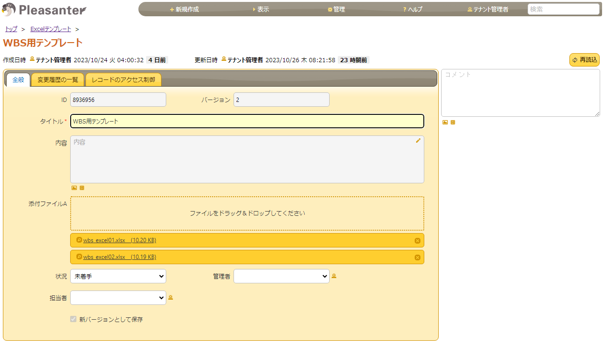

# PleasanterExcelMaker

PleasanterExcelMakerはPleasanterでExcel表を作成するJSライブラリです。  
Excel表は新たに作成するだけではなく、既に作成したExcel表にデータを埋め込む事が可能です。  
各種JSライブラリでPleasanterへのデータアクセスを容易にして、Excel表を作成するビジネスロジックに集中する為に作成しました。

## Pleasanterのバージョン
JSライブラリを読み込む都合上 Ver.1.3.45.0 以上をお勧めします。  
クラウドバージョンについてはAPIを使用する都合上、デモライセンス及びスタンダード以上が必要です。  
オープンソース及びエンタープライズに関しては制限無く使用可能です。  
  
## 使い方
※WBS(Sample)を添付しています。Pleasanter使用時に作成されるデモ用テーブル（またはPleasanter Cloudのデモ環境）のプロジェクト管理の例／WBSをExcelで出力するサンプルを作成しています。


### １．Excel表の準備
埋め込むExcel表を準備します。
参照ファイル：wbs_excel01.xlsx
参照ファイル：wbs_excel02.xlsx
２．Excel登録用の記録テーブルを作成
１で作成したexcelをPleasanterに登録します。
新しい記録テーブルを作成し、添付ファイル項目を追加してください。  
新しいアイテムを作成し、添付ファイルにexcel表を添付して登録します。添付はひとつの添付ファイル項目に複数登録してもかまいません。




### ２．JSライブラリの読み込み
PleasanterExcelMaker.js(https://github.com/senetcojp/PleasanterExcelMaker)及び関連ライブラリをロードする設定をします。
使用するライブラリは
ExcelJS(https://github.com/exceljs/exceljs)
FileSaverJS(https://github.com/eligrey/FileSaver.js)
になります。
参照ファイル：HTML_ライブラリロード.txt


### ３．コマンドボタンの作成
Excel出力用のコマンドボタンを作成します。サンプルでは一覧出力用ボタン（下部）と詳細出力用ボタン（行）に作成しています。
参照ファイル：スクリプト_Excel出力ボタン(下部).txt


参照ファイル：サーバスクリプト_各行に出力ボタンを追加.txt


### ４．出力コードの作成  
参照ファイル：HTML_Excel出力処理.txt


## サンプルコード
```
const em = new PleasanterExcelMaker();
let workbook;
//アイテムID 8936956 に添付している添付ファイルAのファイル名 wbs_excel01.xlsx を取得します。
em.ExcelDownloadItemAttach(8936956,'A','wbs_excel01.xlsx')
.then(function(value){
    workbook = value;
    //Pleasanterの検索条件を取得します。
    let data = {"ApiVersion": 1.0, "View": em.getFilter()}
    //JSONファイルのデータ形式を指定します。
    data.View.ApiDataType = "KeyValues";
    data.View.ApiColumnKeyDisplayType = "ColumnName";
    //取得するフィールドを指定mします。
    data.View.GridColumns = ["IssueId","Ver","Title","Body","StartTime","CompletionTime","WorkValue","ProgressRate","RemainingWorkValue","Status","ClassA","ClassB","ClassC","Owner","Manager"];
    //データを取得します。itemidが0の場合は現在表示しているitemid（$p.id）を取得します。
    em.ApiGet(0, data)
    .then(function(value){
        //ExcelJSのコマンドに依存します。
        //取得したExcel表からSheetを取得します。
        let sheet = workbook.worksheets[0];
        sheet.name = "サンプル01";
        let rset = value.data.Response.Data;
        for( var c=0; c<Object.keys(rset).length; c++) {
            var row = 4+c;
            //セルにデータを書き込みます。
            sheet.getCell(`A${row}`).value = rset[c].IssueId;
            sheet.getCell(`B${row}`).value = rset[c].ClassA;
            sheet.getCell(`C${row}`).value = rset[c].ClassB;
            sheet.getCell(`D${row}`).value = rset[c].ClassC;
            sheet.getCell(`E${row}`).value = rset[c].Title;
            sheet.getCell(`F${row}`).value = rset[c].Body;
            sheet.getCell(`G${row}`).value = rset[c].Manager;
            sheet.getCell(`H${row}`).value = rset[c].Owner;
            let t;
            t = new Date(rset[c].StartTime);
            sheet.getCell(`I${row}`).value = t.getFullYear() + "/" + (t.getMonth()+1) + "/" + t.getDate();
            t = new Date(rset[c].CompletionTime);
            sheet.getCell(`J${row}`).value = t.getFullYear() + "/" + (t.getMonth()+1) + "/" + t.getDate();
            sheet.getCell(`K${row}`).value = rset[c].WorkValue;
            sheet.getCell(`K${row}`).numFmt = '0"h"'
            sheet.getCell(`L${row}`).value = rset[c].ProgressRate;
            sheet.getCell(`L${row}`).numFmt = '0.0"%"'
            sheet.getCell(`M${row}`).value = rset[c].RemainingWorkValue;
            sheet.getCell(`M${row}`).numFmt = '0.0"h"'
            sheet.getCell(`N${row}`).value = rset[c].Status;
            sheet.getCell(`O${row}`).value = rset[c].Ver;
        }
        //Excel表をダウンロードします。
        em.SaveAs(workbook);
    });
});
```

## コマンド（主要）
最初のヘッダー | 2番目のヘッダー
------------ | -------------
ApiGet(id, data) | Itemデータを取得します。Pleasanterの$p.ApiGetを使用して取得します。
Ajax(url, data) | Itemデータを取得します。URL指定で取得します。Itemデータ以外に拡張SQLを使用したデータ取得にも対応できます。
ExcelDownloadFile(excelurl) | URL指定でExcelファイルを取得します。Excel表を[PleasanterRoot]/Implem.Pleasanter/wwwroot配下に置いた場合にURL指定で取得が可能です。
ExcelDownloadGuid(guid) | 添付ファイルのGUIDからExcelファイルを取得します。
ExcelDownloadItemAttach(itemid, attachment, name) | アイテムに登録しているExcelファイルを取得します。
getGuid(itemid, attachment, name) | アイテムID/添付ファイル項目/ファイル名から添付ファイルのGuidを取得します。
ExcelNew(sheetname) | 新しいExcel表を作成します。
SaveAs(workbook, filename) | Excel表をダウンロードします。
getFilter() | Pleasanterの一覧画面で指定した条件を取得する事ができます。

## 最後に
コードの書き方はまだまだ満足するものでは無いので、温かい目で見て頂けたら幸いです。  
改善が必要な点についてはIssuesよりご連絡ください。
